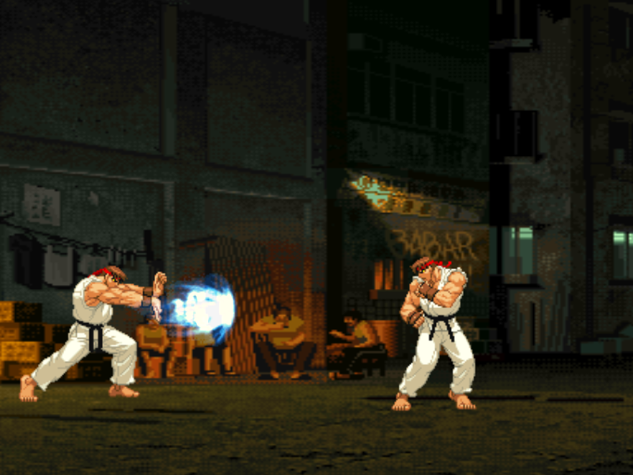
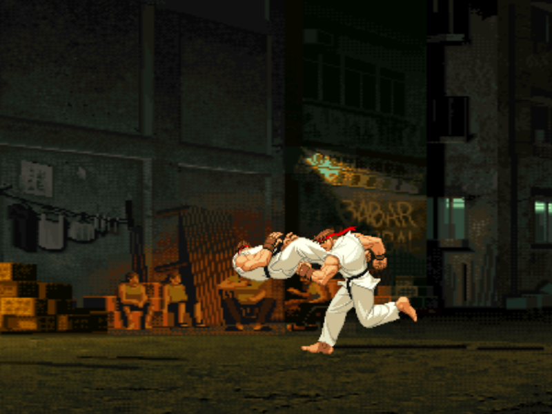
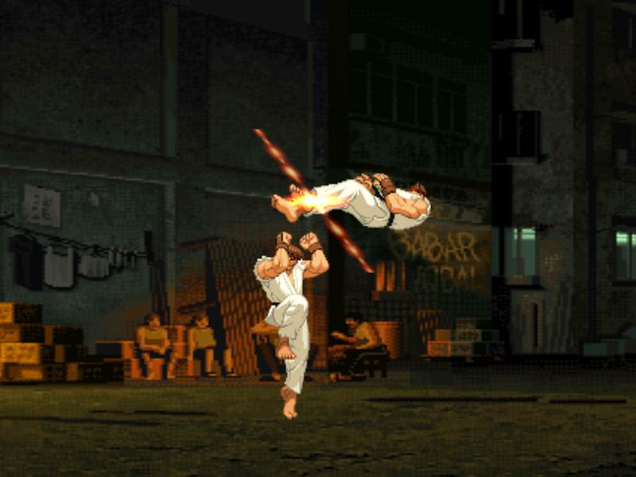
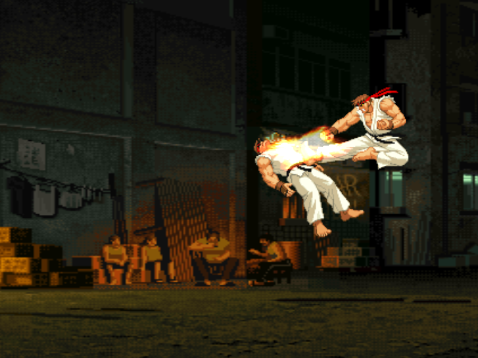

# openfight

This is an open source fighting game written in C++ using SDL.

The project can be built using cmake.

To build in ubuntu install the required packages:

    sudo apt-get install build-essential libxml2-dev libsdl1.2-dev libsdl-image1.2-dev libglu1-mesa-dev

Create a directory that is used for the build and generates the platform specific makefiles:

    cmake -Bbuild
    cmake --build build
    

The project can then be compiled using the generated makefiles:

    ./build/openfight
